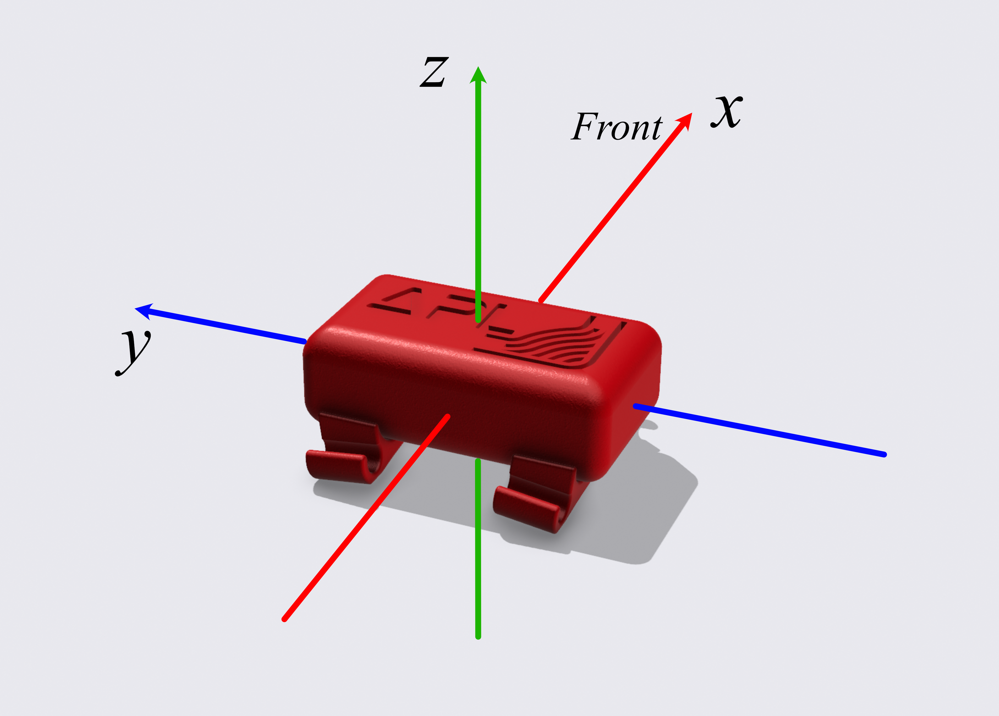

# APL Head Tracker

## A basic inexpensive head tracker based on the GY-521/MPU6050 sensor and [MrHeadTracker](https://git.iem.at/DIY/MrHeadTracker) project 

A head simple head tracker which connects to the computer through a USB cable and communicates rotation information through serial messaging, in both quaternion and YPR angles.

This head tracker is designed to work best with the APL OSC Bridge. 

### Requirements:

> The Amazon links are shown for illustrative purposes. You can source the parts from the supplier that is most convenient for you.

- 1 pc. Arduino Nano V3 - (recommended the mini-usb version). [Amazon link](https://www.amazon.co.uk/ELEGOO-ATmega-Nano328P-compatible-offical/dp/B072BMYZ18/ref=sr_1_22?crid=2IJC8ETMX89AO&keywords=arduino+nano&qid=1677778174&sprefix=arduino+nano%2Caps%2C206&sr=8-22)
- 1 pc. GY-521/MPU6050 IMU [Amazon link](https://www.amazon.co.uk/AZDelivery-MPU-6050-Gyroscope-Accelerometer-Arduino/dp/B07N2ZL34Z/ref=sr_1_3?keywords=mpu6050&qid=1677778395&sprefix=mpu%2Caps%2C108&sr=8-3)
- 1 pc. APL tracker PCB shield: GRBL and SVG files can be found in the [pcb-shield](/pcb-shield/) folder, for home-manufacturing of the PCB shield. Alternatively, PCB shields could be professionally manufactured by companies such as JLCPCB, PCBWay, etc. 
- 1 pc. Micro push button (6 x 6 x 5 mm). [Amazon link](https://www.amazon.co.uk/Youmile-100-Pack-Miniature-Momentary-Tactile-6-x-5-mm/dp/B07Q1BXV7T/ref=sr_1_18?crid=3PPDKX6X536ED&keywords=micro+push+button+6x6x5&qid=1677777592&sprefix=micro+push+button+6x6x5%2Caps%2C184&sr=8-18)
- 1 pc. 2-bit DIP switch. [Amazon link](https://www.amazon.co.uk/sourcing-map-Horizontal-Positions-Breadboards/dp/B07MH6W9QD/ref=sr_1_40?crid=O4T65300S4ND&keywords=2+bit+dip+switch&qid=1677777733&sprefix=2+bit+dip+switch%2Caps%2C89&sr=8-40)
- 1 pc. 7 pin header.
- 2 pc. 5 pin header.
- Enclosure: STL or 3MF files can be found [here](enclosure/) for home-printing of the enclosures. 

## Build instructions:

Make sure you have all the components available before starting the build:

### **Step 1:**

Start by preparing MPU-6050 gyroscope break-out board. Solder the 7-pin header **facing up** on the board. 

>**ATTENTION!:** Do not solder pins **XDA, XCL** and **ADO**. These will be removed later. 

| | |
|-|-|
|||

Using a pair of pliers, carefully remove pins **XDA, XCL** and **ADO**:

### **Step 2:**

Prepare the PCB shield: 

Start by soldering the micro-switch and the 2-pin dip-switch. 

| | |
|-|-|
||
||

Next, solder the two 5-pin headers to the **bottom** of the PCB shield. Make sure they are soldered square to the board, otherwise it may not fit properly to the Arduino. 

| | |
|-|-|
||
||

### **Step 3:**

Solder the MPU-6050 to the **top** of PCB shield, making sure to match the pins on the gyroscope to the pins written on the shield. 

| | |
|-|-|
||

With a pair of flush cutters, carefully cut the excess header pins from the bottom of the PCB shield. This is necessary to ensure the shield can be soldered flush to the Arduino. 

| | |
|-|-|
||

You have now built the core of the head tracker!

| | |
|-|-|
||

### **Step 4:**

Solder the PCB shield to the **top** of Arduino, making sure to match the pins on the shield to the pins on the Arduino. Snip the excess pins flush to the Arduino board to ensure a good fit in the enclosure. 

| | |
|-|-|
||

Now you can set the micro switches as desired: 

- Switch No.1 changes between Quaternions and Yaw-Pitch-Roll output
- Switch No.2 changes between normal and inverse 

To ensure compatibility with the APL OSC bridge, please set the switches as seen in the pictures above: switch no.1 set to on and switch no.2 set to off.

The electronic part of the head tracker is now finished, and you can start using it after flashing the firmware. However, if you own a 3D printer, you can also print an enclosure from the [STLs](/enclosure/) provided:

### **Step 5:**

Make sure all the parts are printed. If additional cleaning of the prints (de-burring or sanding) is required, this would be a great moment for it. Place the head tracker in the enclosure, making sure that the USB port fits the slot in the side. The tracker should be held in place in the enclosure by friction alone. If the fit is tighter than expected, do not force it in, this may damage the enclosure or the PCB; slightly file (or sand) down the edges of the PCB until it fits well. If the fit is loose, you may apply a slight bead of glue between the PCB and the enclosure shelf, to ensure that it does not move.

After ensuring that the tracker does not move in the enclosure, you can now put the lid on. This should just snap in place. Make sure the button lines up with the micro-switch. Test the functionality of the button. You should feel a definite click produced by the button. 

| | |
|-|-|
||
||

Next, clip the feet to the bottom of the enclosure. Make sure that the orientation matches the one shown in the following picture.

| | |
|-|-|
||

### **Congratulations!** You now have a new head tracker! 

| | |
|-|-|
||
||

The tracker can be easily clipped to AKG-style headbands, directly on the wire frames. Alternatively, the tracker can also be mounted to a wide range of other headphones, by using an elastic hairband as shown below. 

| | |
|-|-|
|| 

## Flashing the firmware

### **Step 1:**

1. Download and install the Arduino IDE from https://www.arduino.cc/en/software
2. Connect your head tracker to your computer using a USB cable.

### **Step 2:**

Install the "MIDI" and "MPU6050" [libraries](/arduino/apl-head-tracker/libraries/) (found in this repository, in the `/arduino/apl-head-tracker/libraries/` directory):
  
  1. `Sketch -> Include Library -> Add .ZIP Library`
  2. Add the "MIDI" and "MPU6050" libraries one at a time, using the step above. 

### **Step 3:**

Upload [`apl-head-tracker.ino`](arduino/apl-head-tracker/apl-head-tracker.ino) to your head tracker:

1. Choose your board from `Tools -> Boards -> Arduino AVR boards -> Arduino Nano`
2. Choose the port on which you have connected your head tracker from `Tools -> Port -> YOUR_SERIAL_PORT_HERE`

> INFO: You may have to check if your Arduino board is supported. If the board is using a WCH usb-to-serial converter you may need to install additional drivers in order to be recognised.

1. Press the "Upload" button. If not successful at first, try changing the processor (`Tools -> Processor`) from `ATmega320P` to `ATmega320P (Old Bootloader)` or vice-versa. When the upload is successful you will receive the message 'Done upoading'. 

### Congratulations! You have just flashed the firmware to your head tracker. 

>  You can also verify if the tracker works properly by opening the 'Serial Monitor' (magnifying glass icon in the top-right corner). After the initial calibration (described below) four numbers will show on the screen according to the `w x y z` values (if quaternion is selected) or `yaw pitch roll` (if `ypr` is selected)

Once the tracker is initialized and calibrated to your desired frontal position, the rotation axes are as shown in the following diagram. 

## Calibrating the head tracker

The APL head tracker uses the same calibration method as [MrHeadTracker](https://git.iem.at/DIY/MrHeadTracker). You can mount the tracker in any position or orientation and follow the next steps:

1. Look straight ahead. Press the button for longer than 1 second (Long press)
2. Tilt your head down, looking at the floor. Press the button shortly. (Short press)
3. Look back up. The tracker should now be calibrated, and the position will be stored in the Arduino's EEPROM. You should only repeat this steps when changing the position of the head tracker. 

> **If the head tracker drifts (it will)** you can keep pressing the button shortly (short press < 1s) to re-centre. The tracker will benefit from moving it in a figure-of-8 pattern until it stabilizes. It will also stabilize in time, so it would be also worth considering plugging the tracker in a few minutes prior to using it. 
